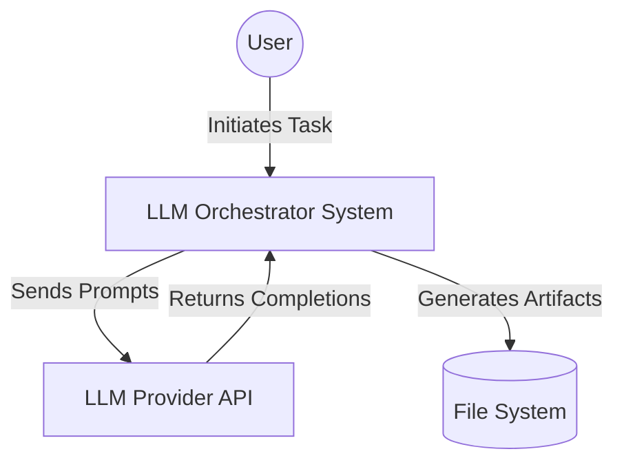
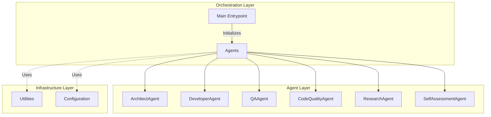

# System Architecture

## Context Diagram



## Container Diagram



## Class Hierarchy

### `Agent` (Base Class)
- **Role**: Abstract base for all specialized agents.
- **Methods**:
  - `perform_task(task: str) -> str`: Public interface.
  - `_execute(task: str, context: Dict) -> str`: Abstract implementation.
  - `_log(message: str)`: Internal logging.

### Specialized Agents
- **`ArchitectAgent`**: Scaffolds project structure.
- **`DeveloperAgent`**: Generates implementation code.
- **`CodeQualityAgent`**: runs static analysis (Ruff/Bandit).
- **`QAAgent`**: Runs unit tests (Pytest).
- **`ResearchAgent`**: Optimizes and analyzes performance.
- **`SelfAssessmentAgent`**: Grades the final output.

## API Documentation
The system currently exposes a CLI entry point:
```bash
python -m llms_orchestration.main
```
This triggers the sequential execution of all agents defined in the `main()` function.
