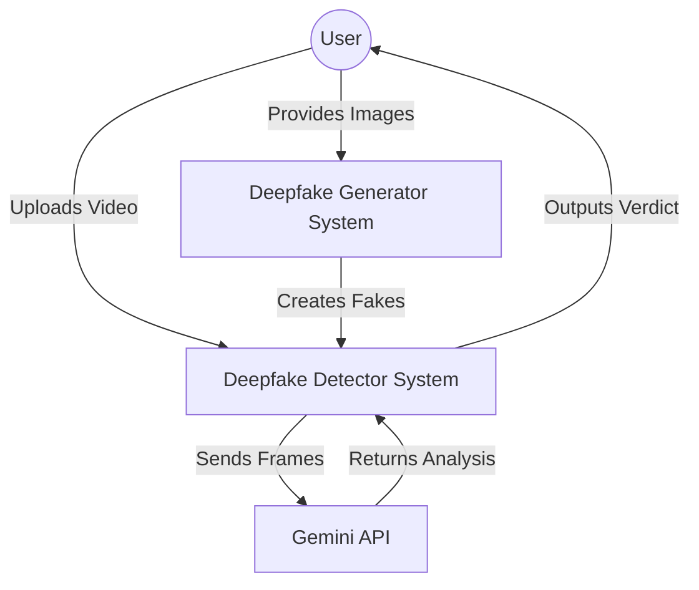
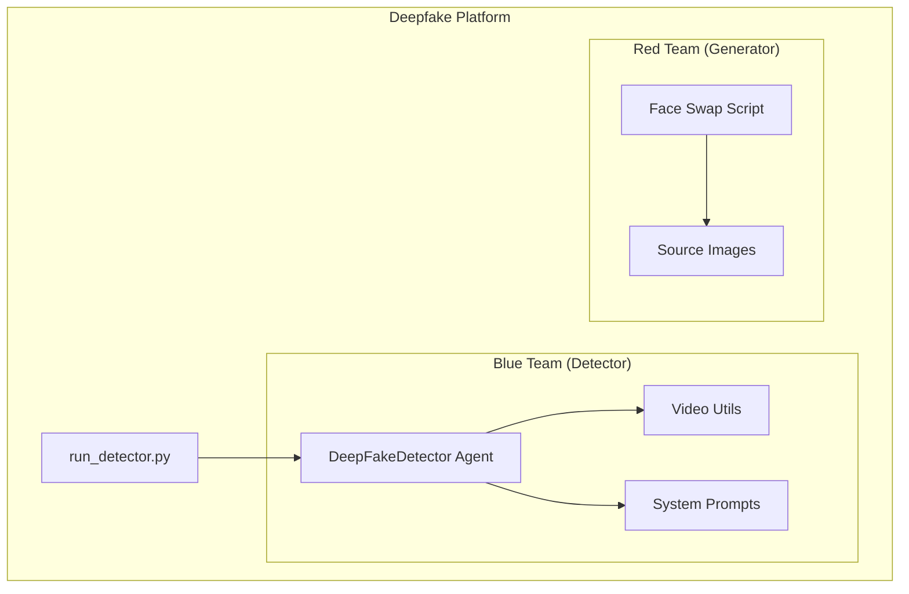

# System Architecture

## Context Diagram



## Container Diagram



## Component Details

### 1. Blue Team: Detector (`src/deepfake_platform/detector`)
- **`agent.py`**: The core orchestrator. Manages the flow of checking API keys, extracting frames, and calling the LLM.
- **`video_utils.py`**: Helper functions for OpenCV-based frame extraction.
- **`prompts.py`**: Contains the forensic persona prompt for Gemini.

### 2. Red Team: Generator (`src/deepfake_platform/generator`)
- **`face_swap.py`**: A standalone script using OpenCV Haar cascades to swap faces from source images onto target videos.

## Data Flow
1. **Input**: User provides a path to an MP4 video.
2. **Preprocessing**: `Video Utils` extracts N frames from the video.
3. **Analysis**: `DeepFakeDetector` constructs a prompt with these frames.
4. **Inference**: Prompt is sent to Gemini 1.5 Flash (via `google-generativeai`).
5. **Output**: JSON response containing `verdict`, `confidence`, and `reasoning`.

## Concurrency Considerations

This system supports **both synchronous and parallel execution**:

### Single Video Mode (Synchronous)
For individual video analysis, synchronous execution is used to keep the code simple and avoid unnecessary complexity.

### Batch Mode (Parallel)
For processing multiple videos, `run_detector.py` implements parallel execution using `concurrent.futures.ThreadPoolExecutor`:

```python
from concurrent.futures import ThreadPoolExecutor

def run_batch_analysis(video_paths: list[str], max_workers: int = 4) -> list[str]:
    with ThreadPoolExecutor(max_workers=max_workers) as executor:
        results = list(executor.map(agent.detect_deepfake, video_paths))
    return results
```

| Mode | Use Case | Implementation |
|------|----------|----------------|
| Single | `python run_detector.py video.mp4` | Synchronous |
| Batch | `python run_detector.py v1.mp4 v2.mp4 v3.mp4` | ThreadPoolExecutor (4 workers) |

**Rate Limiting**: When using batch mode, the Gemini API's rate limits still apply. The detector includes exponential backoff retry logic to handle `429 Resource Exhausted` errors gracefully.

## Extension System & Modularity

The project is designed for easy extensibility through its Building Block architecture.

### How to Add a New Detector
To add a new detection method (e.g., Audio Analyst or Metadata Inspector):

1.  **Create Module**: Add a new file in `src/deepfake_platform/detector/` (e.g., `audio_agent.py`).
2.  **Inherit Interface**: Implement the standard `detect(input_path)` method.
3.  **Register**: Import and add to the `DeepFakeDetector` aggregation logic.

### Plugin Architecture Concept
Future versions can implement a formal plugin system:
```python
class BaseDetector(ABC):
    @abstractmethod
    def analyze(self, media_path: str) -> dict: ...

# New plugins effectively "plug in" to the main agent
detectors = [VisualDetector(), AudioDetector(), MetadataDetector()]
```
