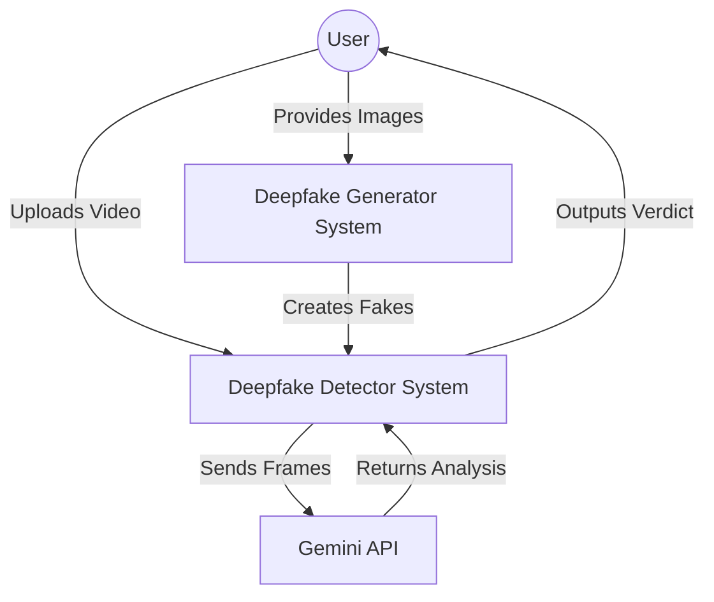
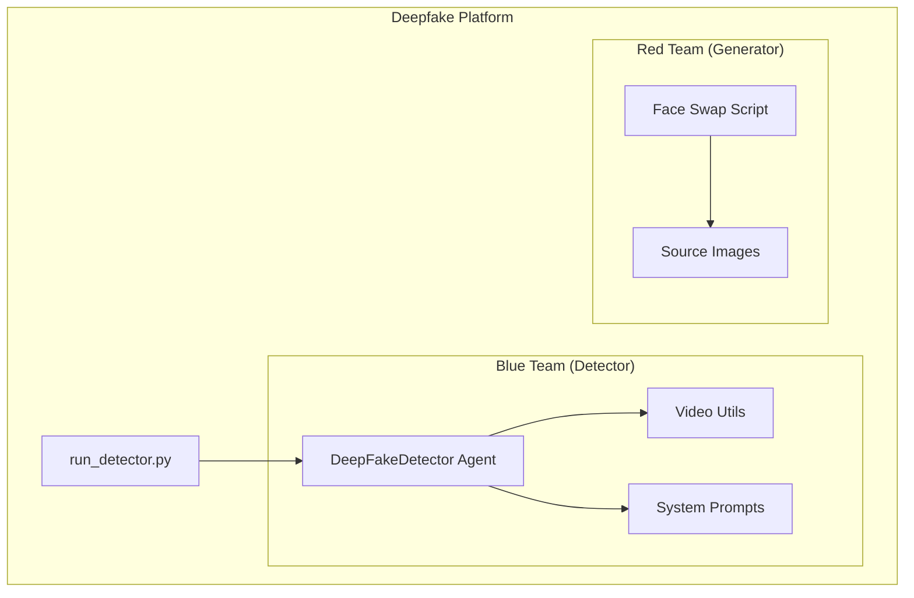

# System Architecture

## Context Diagram

## Container Diagram

## Component Details

### 1. Blue Team: Detector (`src/deepfake_platform/detector`)
- **`agent.py`**: The core orchestrator. Manages the flow of checking API keys, extracting frames, and calling the LLM.
- **`video_utils.py`**: Helper functions for OpenCV-based frame extraction.
- **`prompts.py`**: Contains the forensic persona prompt for Gemini.

### 2. Red Team: Generator (`src/deepfake_platform/generator`)
- **`face_swap.py`**: A standalone script using OpenCV Haar cascades to swap faces from source images onto target videos.

## Data Flow
1. **Input**: User provides a path to an MP4 video.
2. **Preprocessing**: `Video Utils` extracts N frames from the video.
3. **Analysis**: `DeepFakeDetector` constructs a prompt with these frames.
4. **Inference**: Prompt is sent to Gemini 1.5 Flash (via `google-generativeai`).
5. **Output**: JSON response containing `verdict`, `confidence`, and `reasoning`.

## Concurrency Considerations

This system uses **synchronous, single-threaded execution** by design. The rationale:

| Consideration | Decision |
|---------------|----------|
| **API Calls** | Gemini API is called synchronously; parallelization would hit rate limits faster |
| **Frame Extraction** | OpenCV processes frames sequentially; parallelization offers marginal benefit for 3-5 frames |
| **Complexity** | Single-threaded code is easier to debug and maintain for this scope |

**Future Enhancement**: If batch video processing is required, `concurrent.futures.ThreadPoolExecutor` could be used for parallel video preprocessing while respecting API rate limits.
