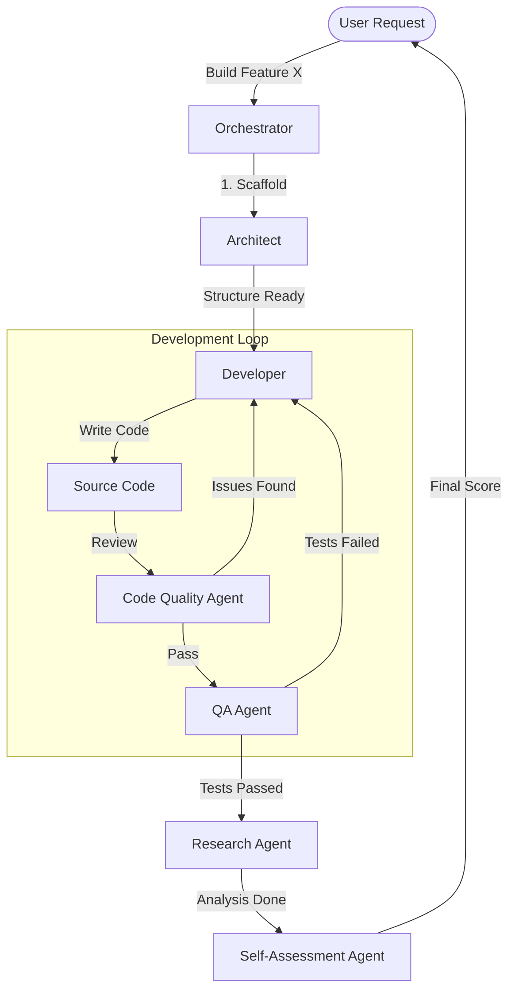

# Agent System Workflow

This document explains the lifecycle of building a feature using our Multi-Agent System.

## The "Assembly Line" Process

We follow a linear but iterative "Assembly Line" workflow. Each agent acts as a gatekeeper for the next stage.

## Agent Interactions

### 1. Architect & Developer
- **Interaction**: The **Architect** provides the "Skeleton". The **Developer** adds the "Flesh".
- **Example**: Architect creates `src/utils/`, Developer writes `src/utils/math.py`.
- **Constraint**: Developer cannot create top-level directories; must ask Architect (simulated).

### 2. Developer & Code Quality (Refinement Loop)
- **Interaction**: The **Developer** writes code. The **Code Quality Agent** immediately scans it.
- **Feedback**: If `LintBot` finds a hardcoded secret or missing docstring, it rejects the code. The Developer must fix it and resubmit.
- **Course Criteria**: This ensures strict adherence to **Criteria 4.3 (Comments)** and **Criteria 5 (Security)**.

### 3. Developer & QA (Testing Loop)
- **Interaction**: Once code passes Quality, **QA Agent** writes and runs tests.
- **Feedback**: If tests fail (coverage < 80% or bugs found), the Developer is tasked to fix the logic.
- **Course Criteria**: Ensures **Criteria 6 (Testing)** and **Criteria 16 (Multiprocessing)** safety.

### 4. Research & System
- **Interaction**: The **Research Agent** observes the stable system. It runs the code with varying inputs (Sensitivity Analysis).
- **Goal**: It does *not* fix code, but generates **Jupyter Notebooks** and **Graphs**.
- **Course Criteria**: Satisfies **Criteria 7 (Research & Analysis)**.

### 5. Self-Assessment Agent (The Final Gate)
- **Interaction**: This agent reads *everything* (Code, Docs, Tests, Notebooks) but changes *nothing*.
- **Output**: A filled-out **Submission Form** and **Grade**.
- **Course Criteria**: **Criteria 1-13**.
